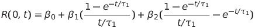

# Estimate Nelson Siegel Model Parameters with Treasury Coupon Bonds
 
### author: Yi Rong
### date: 03/21/21

---

### Problem
The European Central Bank reports the Euro yield curve by providing the Nelson-Siegel parameters. Use the functional form of Nelson-Siegel model to estimate the parameters
&beta;0, &beta;1, &beta;2, &beta;1, &tau;1
for the Treasury Coupon Bonds provided below. The Nelson-Siegel model assumes
that:

### Treasury Coupon Bonds
