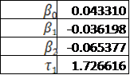

# Estimate Nelson Siegel Model Parameters with Treasury Coupon Bonds
 
### author: Yi Rong
### date: 03/21/21

---

### Problem
The European Central Bank reports the Euro yield curve by providing the Nelson-Siegel parameters. Use the functional form of Nelson-Siegel model to estimate the parameters
&beta;<sub>0</sub>, &beta;<sub>1</sub>, &beta;<sub>2</sub>, &beta;<sub>1</sub>, &tau;<sub>1</sub>
for the Treasury Coupon Bonds provided below. The Nelson-Siegel model assumes
that:


### Treasury Coupon Bonds


### Solution

This problem can be solved by an optimization solver. And in this assignment, I use R and two  different solvers, which are bobyqa and optim. Two results are close, but not the same.

### Step 1 

input data to dataframe


### Step 2 

```{r }
# calculate the dirty price
DirtyPrice<-c()
for (i in 1:29) {
  DirtyPrice[i]<- (0.5 - BondData[i,1]) * BondData[i,3] + BondData[i,4]
}

```

### Step 3

```{r }
# define a function to obtain the objective, which should be minimized
Objective <- function(x){
  
  # take 4 input parameters
  beta0 <- x[1]
  beta1 <- x[2]
  beta2 <- x[3]
  tau1 <- x[4]
  
  # the function for R(0, t)
  R <- function(t, beta0, beta1, beta2, tau1){
    result <- beta0 + beta1 * ((1 - exp(-t / tau1)) / (t / tau1)) + beta2 * ((1 - exp(-t / tau1)) / (t / tau1) - exp(-t / tau1))
    return(result)
  }
  
  # calculate the theoretical price for each bond
  TheoPrice <- function(i){
    
    eR_sum <- 0
    PayTimes <- (BondData[i, 2] - BondData[i, 1]) / 0.5 + 1
    ti <- c()
    
    for(j in (1 : PayTimes)){
      ti[j] <- BondData[i, 1] + 0.5 * (j - 1)
      eR_sum <- eR_sum + exp(-R(ti[j], beta0, beta1, beta2, tau1) * ti[j])
    }
    
    TPresult <- eR_sum * 0.5 * BondData[i, 3] + exp(-R(BondData[i, 2], beta0, beta1, beta2, tau1) * BondData[i, 2]) * 100
    return(TPresult)
  }
  
# calculate the deviation and obtain the objective
  List <- c()
  tmp <- 0
  Objsum <- 0
  for(k in 1 : 29){
    List[k] <- TheoPrice(k)
    tmp <- (1 / BondData[k, 2]) * (List[k] - DirtyPrice[k])^2
    Objsum <- Objsum + tmp
  }
  return(Objsum)
}
```

### Step 4

```{r }
# get result for 4 parameters
Solution1 <- bobyqa(c(0, 0, 0, 2), Objective, lower = c(-1, -1, -1, 1), upper = c(1, 1, 1, 5))
Solution1$par
Solution1$value

Solution2 <- optim(c(0, 0, 0, 2), Objective)
Solution2$par
Solution2$value
```

### Final Results


Since the first result gives a smaller deviation, the four parameters in R(0,t) should be:


